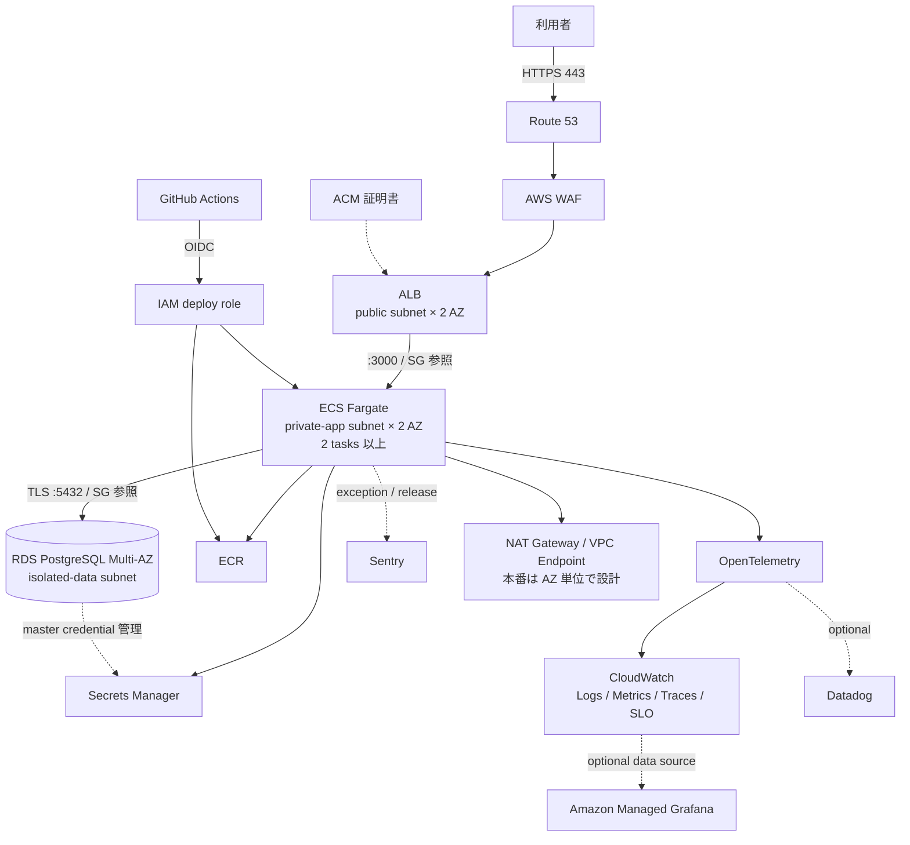

# cairn AWS構成の本番運用準備レビュー

初回デプロイ時点のAWS構成図を、本番運用とポートフォリオ評価の観点からレビューした記録。

- 調査日: 2026-08-13
- 対象: 会話で共有された「cairn — AWS 構成（初回デプロイ時点）」
- 対象リージョン: `ap-northeast-1`（構成図の表記による）
- 実装・デプロイ済みリソースの確認: 未実施
- 対象リポジトリのcommit: 該当なし（文書化時点のワークスペースに実装ファイルなし）

## 結論

現在の構成は、ALB、private subnet上のECS Fargate、RDS、Secrets Manager、ECR、CloudWatch Logsを使った検証環境として妥当である。一方、「本番運用を設計できるシニアエンジニア」のポートフォリオとして示すには、AWSサービスを追加するだけでは足りない。

優先すべきなのは次の5点である。

1. HTTPS、WAF、認証方針、3層subnetによる境界の明確化
2. ECSとRDSのMulti-AZ化、バックアップ復元を含む可用性設計
3. OIDCベースのCI/CD、失敗検知、自動rollback、安全なDB migration
4. SLI/SLOを起点としたログ・メトリクス・トレース・アラーム
5. ADR、runbook、負荷試験、障害復旧演習など、判断と運用実績の提示

Datadog、Sentry、Grafanaは役割が異なる。最初はCloudWatchをAWS基盤監視の基準とし、OpenTelemetryで計装を標準化し、Sentryをアプリケーション例外とrelease追跡に使う案が適している。Datadogは外部SaaS運用を示す追加環境として導入できる。Grafanaはデータ収集基盤ではなく可視化レイヤーとして扱う。

## 調査範囲と行っていないこと

この文書では、共有された構成図の読み取りと、AWS・GitHub・OpenTelemetry・Datadog・Sentryの公式資料に基づく設計レビューを行った。

次の項目は実施していない。

- AWSアカウント、Terraform/CDK、ECS task definition、RDS設定の実査
- アプリケーションコード、認証要件、個人情報の取り扱いの確認
- AWS Pricing Calculatorによる月額費用の再計算
- 負荷試験、failover、rollback、backup restoreの実行
- Datadog、Sentry、Grafanaの実環境への接続

したがって、以下の「図から確認できた事実」と「推奨・推論」は区別して読む必要がある。

## 図から確認できた事実

構成図からは、少なくとも次を確認できる。

- VPC CIDRは`10.0.0.0/16`
- public subnetは2 AZ構成
- private subnetは2 AZ構成で、ECSとRDSにpublic IPを付与しない意図
- ALBはHTTP `:80`を受信し、ECSの`:3000`へ転送
- ALBのhealth check endpointは`/health`
- ECS FargateはARM64、`0.25 vCPU / 0.5 GB`
- RDS PostgreSQL 17、`db.t4g.micro`
- ECSからRDSへ`:5432`、`sslmode=require`で接続する意図
- NAT Gatewayは1台のみで、コスト優先の妥協であることを明記
- Secrets ManagerでDBパスワードを管理する意図
- CloudWatch Logsの保持期間は7日
- 現フェーズでは認証なし、ALBの受信元を自宅IP `/32`へ制限
- 次フェーズでALB + CognitoとHTTPSを追加する予定
- Security GroupはIPアドレスではなくSG ID参照で制御する方針

次は図だけでは確定できない。

- ECS serviceの`desiredCount`とAZ間の配置状態
- RDSがSingle-AZかMulti-AZか
- RDSのバックアップ保持期間、削除保護、暗号化、parameter group
- ECS task roleとtask execution roleの権限
- NAT Gatewayおよびroute tableの具体的なAZ対応
- ECR image scanning、tag immutability、lifecycle policy
- CloudTrail、GuardDuty、Security Hub、AWS Configなどのアカウント基盤

## 全体像

推奨する論理構成を以下に示す。編集可能なソースは [`assets/cairn-target-architecture.mmd`](assets/cairn-target-architecture.mmd) に保存している。

図中の接続関係は、現在の図から次のように修正する。

- ECSがECRからimageを取得する
- ECSがSecrets Managerからsecretを取得する
- ECSがCloudWatchへログやtelemetryを送信する
- ECSがRDSへ接続する
- RDSがmaster credentialをSecrets Managerで管理する場合がある
- ECR、Secrets Manager、CloudWatch Logsは直列の依存関係ではない

## 公式資料から確認できた設計原則

### ネットワークと可用性

AWSは、Fargate taskをprivate subnetへ配置し、ALBのSecurity Groupからだけtaskへの受信を許可する構成を推奨している。また、NAT Gatewayを使用する場合、1つのAZ障害で外向き通信を失わないようAZごとに配置することを推奨している。

本番相当の構成ではsubnetを次の3層に分ける。

- `public`: ALB、AZごとのNAT Gateway
- `private-app`: ECS Fargate
- `isolated-data`: RDS。Internet GatewayやNATへのdefault routeを持たせない

Security Groupは次の参照関係とする。

- Internet → ALB SG: `443`
- ALB SG → ECS SG: `3000`
- ECS SG → RDS SG: `5432`

ECSは2 task以上を2 AZへ分散する。NAT Gateway 1台はdemo環境のコスト最適化として残せるが、本番環境では単一AZへの依存とcross-AZ通信を受け入れる設計になる。この差は設定ミスではなく、ADRで説明すべき意図的なトレードオフである。

### TLS、WAF、認証

利用者からALBまではACM証明書を使ったHTTPS `:443`とし、HTTP `:80`はHTTPSへredirectする。WAFにはmanaged rulesとrate-based ruleを配置するが、最初はCount modeでfalse positiveを確認してからBlockへ移行する。

WAFは認証の代替ではない。認証方式はアプリケーション要件により分ける。

- 公開アプリの利用者認証: Cognito User Poolまたは外部OIDC
- API単位・リソース単位の認可: アプリケーション側で実施
- 管理画面だけの制限: Cognito/OIDCに加えてWAF IP setなどを検討
- 個人だけが使う非公開環境: 公開ALB + IP制限以外にVerified AccessやVPNも比較

### RDSとデータ保護

RDS PostgreSQL 17ではTLS接続を要求する設定が標準だが、クライアント側の`sslmode=require`はサーバー証明書の完全な検証を意味しない。可能ならRDS CAを配置し、`sslmode=verify-full`でhostnameと証明書chainを検証する。

本番相当プロファイルでは次を設定する。

- Multi-AZ
- storage encryption
- deletion protection
- 自動バックアップとPITR
- 最終snapshotまたはretained automated backup
- maintenance windowとminor version update方針
- CloudWatch Database Insights、CPU、接続数、空き容量、lockの監視
- RPO/RTOを決めた定期的なrestore test

アプリケーションはmaster userを使わず、専用の最小権限DB userを使う。RDS管理のmaster credentialとアプリ用credentialを分離する。

Secrets ManagerのsecretをECS task起動時に環境変数へ注入する方式では、ローテーション後の値が既存taskへ自動反映されない。rotation後の再デプロイ、またはアプリケーションによるruntime取得とcacheのどちらを採用するか決める必要がある。

### コンテナとIAM

ECSではtask roleとtask execution roleを分離する。

- task execution role: ECR pull、CloudWatch Logs、task起動時のsecret参照など
- task role: 実行中のアプリケーションがAWS APIへアクセスする権限

コンテナはnon-root userで実行し、可能ならread-only root filesystem、最小image、不要なLinux capabilitiesの除去を行う。ECRはimmutable tag、lifecycle policy、Amazon Inspectorによるenhanced scanningを使う。

read-only root filesystemとECS Execには制約があるため、常時ECS Execを有効化する前提にはしない。障害調査時に承認付きのtoolbox taskや専用task revisionを起動するbreak-glass手順を別に定義する。

### CI/CDと変更管理

GitHub ActionsからAWSへの接続にはOIDCを使い、長期Access KeyをGitHub Secretsへ保存しない。deploy roleのtrust policyはrepository、branchまたはGitHub Environmentで制限する。

初期段階の安全なdelivery pipelineは次の順序とする。

1. unit test、lint、type check
2. dependency、Dockerfile、IaC、secretのscan
3. image build、SBOM生成、ECR push
4. image digestを固定してECSへdeploy
5. ECS Deployment Circuit BreakerとCloudWatch Alarmで失敗を検知
6. 自動rollback
7. smoke testとSentry release/deploy記録

DB migrationはCI runnerからRDSへ直接接続せず、private subnet内の一時ECS taskとして実行する。migrationは新旧アプリケーションが同時稼働できる後方互換な手順にする。

rolling deploymentと自動rollbackを先に安定させ、その後ECSネイティブのBlue/GreenまたはCanary、bake time、lifecycle hookへ進む。

## Observabilityの比較と判断

| 選択肢 | 主な役割 | この構成での判断 |
|---|---|---|
| CloudWatch | AWS metrics、logs、alarms、APM、SLO | AWS基盤監視の必須baseline |
| OpenTelemetry | metrics、logs、tracesのvendor-neutralな計装 | アプリケーション計装の基準にする |
| Sentry | exception、stack trace、影響user、releaseとの関連 | アプリケーション障害解析に使う |
| Datadog | infrastructure、APM、logs、tracesの統合SaaS | 外部監視SaaSを扱う追加環境として有効 |
| Grafana | 複数data sourceのdashboardとalerting | CloudWatchやPrometheusの可視化レイヤー |

推奨baselineは次の組み合わせである。

- CloudWatch Logs、Container Insights、Application Signals、Synthetics
- OpenTelemetryによるtrace、metricの計装
- Sentryによるexceptionとreleaseの追跡
- CloudWatch AlarmをAWS側の一次障害通知として維持

Datadogを導入する場合は、Fargate taskへAgentまたはDatadog Distribution of OpenTelemetry Collectorをsidecarとして追加する。sidecarのCPU・memoryが必要になるため、現在の`0.25 vCPU / 0.5 GB`をそのまま使えるとは限らず、負荷試験による再サイジングが必要である。

Grafanaを試す場合、最初からPrometheus、Loki、Tempoをすべて構築する必要はない。Amazon Managed GrafanaからCloudWatchをdata sourceとして参照し、独自metricや長期保存要件が出てからAmazon Managed Service for Prometheusなどを追加する。

## SLI、SLO、アラーム

dashboardを作る前に、利用者視点のSLI/SLOを定義する。

- Availability: 有効なrequestに対する正常response率
- Latency: p50、p95、p99
- Error rate: ALB 5xx、application exception、dependency error
- Saturation: ECS CPU/memory、task数、DB接続数、DB空き容量
- Synthetic: loginや主要操作が完了するか
- Deployment health: release前後のerror rate、latency、rollback発生

アラームは個々のCPU変動ではなく、利用者影響と枯渇兆候を中心にする。CloudWatch Application SignalsのSLOとburn-rate alarmを利用できる。

構造化ログには少なくとも次を含める。

- `timestamp`
- `level`
- `service`
- `environment`
- `release`またはGit SHA
- `request_id`
- `trace_id`
- HTTP method、正規化したpath、status、latency

token、password、Cookie、Authorization header、個人情報は記録しない。userを関連付ける場合は、用途と保持期間を決めた非可逆なidentifierを使う。

## アカウントとセキュリティ基盤

ポートフォリオでAWS Security Reference Architectureをすべて再現する必要はないが、少なくともproductionとnon-productionを別AWS accountへ分離する価値がある。human accessはIAM Identity CenterとMFAを使い、workloadをOrganizations management accountへ置かない。

長期稼働させるproduction相当環境では次を検討する。

- multi-Region CloudTrail trailと保護されたS3保存先
- GuardDuty
- Security Hub CSPM
- IAM Access Analyzer
- VPC Flow Logs
- AWS Configは必要なcontrolと費用を評価して導入
- AWS BudgetsとCost Anomaly Detection

これらは有効化するだけで完成ではない。findingの通知先、owner、対応期限、例外管理、runbookまで定義する。

## 環境プロファイル

コストと本番要件を同じ設定へ押し込まず、IaCで明示的に分ける。

| 項目 | demo | production-like |
|---|---|---|
| ECS task | 1 taskも許容 | 2 tasks以上、2 AZ |
| NAT Gateway | 1台も許容 | AZごと |
| RDS | Single-AZも許容 | Multi-AZ |
| deletion protection | 無効も許容 | 有効 |
| backup | 短期 | RPOに基づくPITRとrestore test |
| monitoring | 基本metrics/logs | SLO、synthetic、paging alarm |
| removal policy | `DESTROY`可 | `SNAPSHOT`または`RETAIN` |

「利用後はdestroyし、ECRだけが残る」という現在の説明はdemo環境に限定する。本番相当ではRDS snapshot、retained backup、CloudWatch Logs、Secrets Managerのrecovery windowなどが残る可能性があり、それが意図したデータ保護である。

固定の「合計約 `$0.13/時間`」だけでは実費を表現できない。少なくともNAT data processing、cross-AZ転送、ALB LCU、public IPv4、CloudWatch ingestion、WAF、Secrets Manager、RDS storage/backup、Datadogなどを含める。IaCのtagging、AWS Budgets、Cost Anomaly Detection、実績cost reportを成果物に含める。

## ポートフォリオで提示する証拠

サービス一覧より、設計判断と復旧能力を示す。

- 現在構成と目標構成のarchitecture diagram
- Single NATとAZ単位NATのADR
- Single-AZ RDSとMulti-AZ RDSのADR
- CloudWatch、Datadog、Grafanaの選定ADR
- threat modelとdata classification
- SLO、alarm一覧、dashboard
- deploy、rollback、DB migrationのrunbook
- incident responseとbreak-glass手順
- 月額cost report
- Well-Architected review
- 障害演習の時刻、結果、観察ログ、改善点

実演候補は次のとおり。

1. ECS taskを1台停止してもrequestを処理し続ける
2. `/health`が失敗するimageをdeployし、自動rollbackする
3. secret rotation後も新規DB connectionが成功する
4. RDS failover後にアプリケーションが再接続する
5. backupから別RDSへrestoreし、RTO/RPOを記録する
6. 負荷増加でECSがscale-outし、DB connection poolが枯渇しない
7. WAFが想定したattack patternまたは過剰requestだけを遮断する
8. SentryまたはDatadogでerrorからrelease、trace、DB処理まで追跡する

## 未確認事項と制約

実装へ進む前に、次を確認する必要がある。

- cairnの利用者、公開範囲、認証・認可モデル
- 保存するデータと個人情報・機密情報の有無
- 許容停止時間、RTO、RPO、目標SLO
- 平常時とpeak時のrequest数、background jobの有無
- 使用中のIaCとCI/CD構成
- RDSの実際のMulti-AZ、backup、encryption設定
- DatadogまたはSentryへ送信してよいデータの範囲
- 月額cost上限とproduction-like環境の稼働時間

これらが未確定のため、Multi-Region、Aurora、RDS Proxy、CloudFront、SQSなどを現時点で必須とはしない。要件なしに追加すると、設計力より過剰構成を示す可能性がある。

## プロジェクトへの判断

実装順は次とするのが妥当である。

1. HTTPS、WAF、subnet/SGの境界、ECS 2 task、RDS data subnet
2. RDS backup、deletion protection、TLS検証、専用DB user
3. GitHub OIDC、immutable image、circuit breaker、rollback、migration task
4. OpenTelemetry、CloudWatch Application Signals、Sentry、SLO
5. Multi-AZ failover、restore、load、WAF、secret rotationの演習
6. 必要に応じてDatadogまたはAmazon Managed Grafanaを追加

Datadog、Grafana、Security Hubなどのサービス数を完成条件にしない。完成条件は、要件に対して選択理由があり、障害を検知し、変更を安全に戻し、データを復元でき、その結果が記録されていることとする。

## 最小の次の実験

最初の実験は「ECS serviceを2 task・2 AZ構成にし、Deployment Circuit Breakerとrollbackを有効化したうえで、`/health`が失敗するimageを意図的にdeployする」とする。

次を記録する。

- deploy開始時刻
- unhealthy判定までの時間
- rollback開始・完了時刻
- deploy中の正常request率と最大latency
- ECS event、ALB target health、CloudWatch Logs
- rollback後のtask definition revisionとimage digest

この一つの実験で、Multi-AZ配置、health check、観測性、変更失敗の検知、rollback、利用者影響をまとめて検証できる。

## 参考資料

### AWS

- [AWS Well-Architected Framework](https://docs.aws.amazon.com/wellarchitected/2025-02-25/framework/definitions.html)
- [Network security best practices for Amazon ECS](https://docs.aws.amazon.com/AmazonECS/latest/developerguide/security-network.html)
- [Connect Amazon ECS applications to the internet](https://docs.aws.amazon.com/AmazonECS/latest/developerguide/networking-outbound.html)
- [Amazon ECS task and container security best practices](https://docs.aws.amazon.com/AmazonECS/latest/developerguide/security-tasks-containers.html)
- [Best practices for IAM roles in Amazon ECS](https://docs.aws.amazon.com/AmazonECS/latest/developerguide/security-iam-roles.html)
- [Amazon ECS deployment failure detection](https://docs.aws.amazon.com/AmazonECS/latest/developerguide/deployment-failure-detection.html)
- [Amazon ECS blue/green deployment implementation](https://docs.aws.amazon.com/AmazonECS/latest/developerguide/blue-green-deployment-implementation.html)
- [Amazon ECR enhanced scanning](https://docs.aws.amazon.com/AmazonECR/latest/userguide/image-scanning-enhanced.html)
- [Using SSL with a PostgreSQL DB instance](https://docs.aws.amazon.com/AmazonRDS/latest/UserGuide/PostgreSQL.Concepts.General.SSL.html)
- [Introduction to Amazon RDS backups](https://docs.aws.amazon.com/AmazonRDS/latest/UserGuide/USER_WorkingWithAutomatedBackups.html)
- [Backup and recovery for Amazon RDS](https://docs.aws.amazon.com/prescriptive-guidance/latest/backup-recovery/rds.html)
- [Password management with Amazon RDS and AWS Secrets Manager](https://docs.aws.amazon.com/AmazonRDS/latest/UserGuide/rds-secrets-manager.html)
- [AWS Secrets Manager best practices](https://docs.aws.amazon.com/secretsmanager/latest/userguide/best-practices.html)
- [CloudWatch Application Signals](https://docs.aws.amazon.com/AmazonCloudWatch/latest/monitoring/CloudWatch-Application-Monitoring-Intro.html)
- [CloudWatch Service Level Objectives](https://docs.aws.amazon.com/AmazonCloudWatch/latest/monitoring/CloudWatch-ServiceLevelObjectives.html)
- [AWS WAF rate-based rules](https://docs.aws.amazon.com/whitepapers/latest/aws-best-practices-ddos-resiliency/aws-waf-rate-based-rules.html)
- [Design principles for an AWS multi-account strategy](https://docs.aws.amazon.com/whitepapers/latest/organizing-your-aws-environment/design-principles-for-your-multi-account-strategy.html)

### CI/CD・Observability

- [GitHub Actions: Configuring OpenID Connect in AWS](https://docs.github.com/en/actions/how-tos/secure-your-work/security-harden-deployments/oidc-in-aws)
- [OpenTelemetry Collector](https://opentelemetry.io/docs/collector/)
- [Datadog: Amazon ECS on AWS Fargate](https://docs.datadoghq.com/integrations/aws-fargate/)
- [Amazon Managed Grafana data sources](https://docs.aws.amazon.com/grafana/latest/userguide/v9-alerting-explore-datasources.html)
- [Sentry Issue Details](https://docs.sentry.io/product/issues/issue-details/)
- [Sentry Releases API](https://docs.sentry.io/api/releases/create-a-new-release-for-an-organization/)
