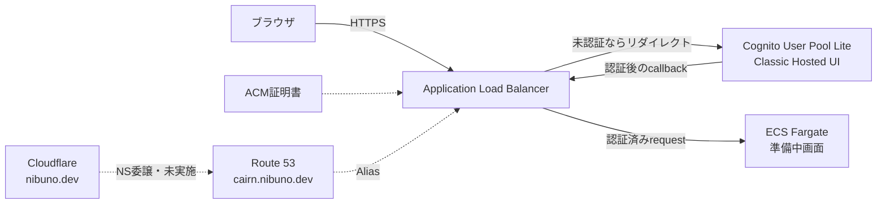

# Cairn 初回公開準備の実装記録

- 記録日: 2026-08-14
- 対象: `cairn.nibuno.dev` の最初のAWS公開
- 対象コミット: [`021ef71`](https://github.com/nibuno/cairn/commit/021ef714108b4aa850b20c4534fad0860798cdbc) から [`260e085`](https://github.com/nibuno/cairn/commit/260e0854a2a78905e2920e922a628290946d51d3) まで

## 結論

`cairn.nibuno.dev` を、Cognitoのメールアドレス＋パスワード認証を通した後にECS Fargateの準備中画面へ接続するコードまで実装した。ローカルテスト、Dockerイメージのビルド、CDKの型検査・テスト・CloudFormation生成は成功している。

ただし、AWSへのデプロイとCloudflareのDNS変更はまだ行っていない。したがって、現時点で `https://cairn.nibuno.dev` が公開されたわけではなく、この作業によってAWSリソースや継続課金も作成されていない。

## 実装した構成

次の図は、CDKがこれからAWS上へ作成する構成である。実在するリソースの現況図ではない。

編集用の図は [`assets/cairn-first-deploy-implemented.mmd`](./assets/cairn-first-deploy-implemented.mmd) に置いた。

## 今回行ったこと

### 1. リポジトリと説明資料を用意した

GitHubの `nibuno/cairn` リポジトリを作り、ドメイン、AWS、DNSの役割を説明するHTMLを追加した。

- コミット: [`021ef71 docs: initialize Cairn project`](https://github.com/nibuno/cairn/commit/021ef714108b4aa850b20c4534fad0860798cdbc)
- 説明資料: [`cairn-domain-guide.html`](./cairn-domain-guide.html)

### 2. 単体で動く準備中画面を実装した

外部パッケージに依存しないNode.js HTTPサーバーを作った。`GET /` は準備中画面、`GET /health` はECSとALB用のヘルスチェックを返す。Dockerで単体起動できる。

- コミット: [`3bb5f71 feat: add authenticated placeholder app`](https://github.com/nibuno/cairn/commit/3bb5f712e3051fee8d776b5de68bc95ee748d480)
- 実装: [`app/src/server.mjs`](../app/src/server.mjs)
- テスト: [`app/test/server.test.mjs`](../app/test/server.test.mjs)

ローカル起動ではALBとCognitoを経由しないため、ログイン画面は出ない。画面だけを `http://localhost:3000` で確認する構成である。

### 3. Cognitoで保護するAWS構成をCDKで実装した

以下をAWS CDKで定義した。

- `cairn.nibuno.dev` 用のRoute 53 Public Hosted Zone
- DNS検証するACM証明書
- Cognito User Pool、App Client、Hosted UI用ドメイン
- HTTPからHTTPSへ転送する公開ALB
- 未認証requestをCognitoへ送るALBの `authenticate-cognito` action
- private subnetで1 taskを動かすARM64 ECS Fargate service
- ALBからだけ3000番ポートへ接続できるSecurity Group
- 1週間保持するCloudWatch Logs
- ALB Alias record

- コミット: [`fb8f36d feat: add Cognito-protected ECS infrastructure`](https://github.com/nibuno/cairn/commit/fb8f36db3b2abf6763d4eb4dbe05bf96e42643d9)
- DNS stack: [`infra/lib/cairn-domain-stack.ts`](../infra/lib/cairn-domain-stack.ts)
- Web stack: [`infra/lib/cairn-web-stack.ts`](../infra/lib/cairn-web-stack.ts)
- 構成テスト: [`infra/test/stacks.test.ts`](../infra/test/stacks.test.ts)

初期構成ではRDS、WAF、GitHub Actionsを作っていない。NAT Gatewayは費用を抑えるため1台にしている。

### 4. CognitoをLiteへ明示的に絞った

CognitoのUser PoolにはLite、Essentials、Plusというfeature planがある。これはCognitoとは別のサービス名ではなく、User Poolで使える機能範囲の違いである。新規User Poolは既定でEssentialsになるため、今回使うCDKでは `FeaturePlan.LITE` を明示した。

今回必要なのは、メールアドレス＋パスワード、OAuth 2.0 Authorization Code Grant、ALBとの連携だけである。パスキー、passwordless、Managed Loginのビジュアルエディタなどは使わないため、LiteとClassic Hosted UIを採用した。将来それらが必要になった時点でEssentialsを再検討する。

- コミット: [`80e94b refactor: use Cognito Lite hosted UI`](https://github.com/nibuno/cairn/commit/80e94b2b11affd74dbf7308ab5d9870ca41e87e2)
- 設計判断: [`ADR 0001`](./adr/0001-alb-cognito-authentication.md)
- AWS公式: [User pool feature plans](https://docs.aws.amazon.com/cognito/latest/developerguide/cognito-sign-in-feature-plans.html)

そのほか、public self sign-upは無効にし、最初の利用者は管理者が作る。認証sessionは12時間、callback URLは `https://cairn.nibuno.dev/oauth2/idpresponse` とした。

### 5. 初回デプロイ手順を分割して記録した

初回はDNS委譲を途中で行う必要があるため、一度にすべてをデプロイしない手順にした。

1. `CairnDomainStack` だけをデプロイする
2. 出力された4つのNSをCloudflareへ登録する
3. DNS委譲を確認する
4. `CairnWebStack` をデプロイする
5. 最初のCognito利用者を作る

- コミット: [`260e085 docs: explain the first Cognito deployment`](https://github.com/nibuno/cairn/commit/260e0854a2a78905e2920e922a628290946d51d3)
- 手順書: [`first-deploy.md`](./first-deploy.md)

## 確認できたこと

2026-08-14にローカルで以下を実行し、成功を確認した。

| 対象 | 確認内容 | 結果 |
|---|---|---|
| Node.jsアプリ | `/health`、準備中画面、404、security headerの3テスト | 3件成功 |
| Docker | `node:22-alpine` を使ったアプリイメージのbuild | 成功 |
| CDK | TypeScriptの型検査 | 成功 |
| CDK | Route 53保持、Cognito認証、private ARM64 taskなどの構成テスト | 3件成功 |
| CDK | CloudFormation templateのsynth | 成功 |
| AWS | `Cairn` で始まるCloudFormation stackの照会 | 0件 |

最後の照会結果から、少なくとも対象AWSアカウントにはCairnのCloudFormation stackがまだ存在しないことを確認した。

記録当初はRoute 53 Hosted ZoneとCognito User Poolを削除時も保持する設計だった。その後、一時デプロイ後にまとめて片付ける方針へ変更し、現在は両方ともStackと一緒に削除する。Cognito利用者も削除されるため、本番運用へ移る前に保持方針を再検討する。

## まだ行っていないこと

- `CairnDomainStack` と `CairnWebStack` のAWSへのデプロイ
- CloudflareからRoute 53へのNS委譲
- ACM証明書の発行完了確認
- Cognitoの最初の利用者作成と実際のログイン
- ALB、Cognito、ECSを通したブラウザでのend-to-end確認
- 実測したAWS料金の確認

最終的なCDK synthは成功したが、ローカルのNode.js 20に関する将来のサポート警告、cross-stack referenceの既定値、Security Groupの重複したegress指定に関する警告が出ている。また、別のsynthではCDK lookup roleを引き受けられず現在の認証情報で処理を継続した旨も表示された。実デプロイ前にAWS権限を確認し、Node.js 22への更新とCDK警告の整理は後続作業で行う。

## 次の一手

次は、内容と発生しうる料金を確認したうえで `CairnDomainStack` だけをデプロイし、Cloudflareへ登録する4つのNSを取得する。これはAWS上の状態を変更するため、自動では実行していない。

## 参考資料

- [Authenticate users using an Application Load Balancer](https://docs.aws.amazon.com/elasticloadbalancing/latest/application/listener-authenticate-users.html)
- [Amazon Cognito user pool feature plans](https://docs.aws.amazon.com/cognito/latest/developerguide/cognito-sign-in-feature-plans.html)
- [`README.md`](../README.md)
- [`first-deploy.md`](./first-deploy.md)
- [`ADR 0001`](./adr/0001-alb-cognito-authentication.md)
