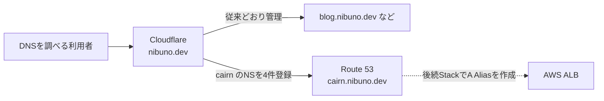

# Cloudflare管理のドメインからRoute 53へサブドメインを委譲する

Cloudflareで管理している `nibuno.dev` はそのままにして、`cairn.nibuno.dev` だけをAmazon Route 53で管理するまでの判断と作業を記録する。

- 調査・作業日: 2026-08-15
- 対象commit: [`d8a928b`](https://github.com/nibuno/cairn/commit/d8a928b31dc0141bbe9c85f2f02e10fb844e6a34)
- 対象バージョン: AWS CDK CLI 2.1136.0、`aws-cdk-lib` 2.265.0

## 結論

今回行うのは、Route 53に `cairn.nibuno.dev` のPublic Hosted Zoneを1つ作り、Route 53が割り当てた4つのネームサーバーをCloudflareへNSレコードとして登録することだけである。

この操作で `nibuno.dev` 全体がAWSへ移るわけではない。`blog.nibuno.dev` などの兄弟サブドメインは引き続きCloudflareで管理できる。一方、委譲後の `cairn.nibuno.dev` と `api.cairn.nibuno.dev` のような配下の名前はRoute 53で管理する。

この段階ではALB、ECS、Cognitoはまだ作らない。まずDNS委譲だけを完了させ、その後のStackで証明書とアプリを作る。

## 全体像



編集用の図は [`assets/cloudflare-route53-subdomain-delegation.mmd`](./assets/cloudflare-route53-subdomain-delegation.mmd) に置いた。

## DNSの用語を最小限に整理する

- **DNS**: `cairn.nibuno.dev` という名前から接続先を調べる案内所
- **Hosted Zone**: あるドメインやサブドメインのDNSレコードをまとめて管理する単位
- **NSレコード**: 「この名前については、このDNSサーバーへ聞く」と委任するレコード
- **Aレコード**: 名前をIPv4アドレスへ結び付けるレコード
- **Aliasレコード**: Route 53が提供する、名前をALBなどのAWSリソースへ結び付ける機能

Cloudflareへ登録するNSレコードは、Webサーバーの住所を直接示すものではない。「`cairn` の案内はRoute 53へ聞く」という案内を追加するものである。

## 実行前に確認できたこと

2026-08-15時点で、次は実際にコマンドを実行して確認した。

| 確認内容 | 観察結果 |
|---|---|
| `nibuno.dev` の公開NS | `drew.ns.cloudflare.com`、`hera.ns.cloudflare.com` |
| `cairn.nibuno.dev` の公開NSとA | どちらも未登録 |
| AWS CloudFormation | `Cairn` で始まるStackは0件 |
| Route 53 | `cairn.nibuno.dev` のHosted Zoneは0件 |
| `cdk diff CairnDomainStack` | Route 53 Public Hosted Zone 1件の追加だけ |

差分では、Hosted Zone IDと4つのネームサーバーをStack outputに出すことも確認した。実装は [`infra/lib/cairn-domain-stack.ts`](../infra/lib/cairn-domain-stack.ts) にある。

AWSとCloudflareも、子サブドメインと同名のHosted Zoneを作り、そのネームサーバーを親側のNSレコードへ登録する手順を案内している。

- [Routing traffic for subdomains — Amazon Route 53](https://docs.aws.amazon.com/Route53/latest/DeveloperGuide/dns-routing-traffic-for-subdomains.html)
- [Delegate subdomains — Cloudflare DNS](https://developers.cloudflare.com/dns/manage-dns-records/how-to/subdomains-outside-cloudflare/)

## 手順1: 正しいディレクトリへ移動する

CDKコマンドは `cdk.json` がある `infra` ディレクトリで実行する。

```bash
cd /Users/tatsuya/tsumiage/cairn/infra
pwd
ls cdk.json package.json
npm ci
```

`pwd` の期待値は次である。

```text
/Users/tatsuya/tsumiage/cairn/infra
```

別の `cairn` ディレクトリで `npx cdk deploy CairnDomainStack` を実行すると、ローカルのCDKと `cdk.json` が見つからず、CDKの追加インストール確認に続いて次のエラーになった。

```text
--app is required either in command-line, in cdk.json or in ~/.cdk.json
```

このエラーが出た時点では、AWSリソースは作成されていない。`--app` を手入力して回避せず、まず現在位置を直す。

## 手順2: 作成予定を確認する

次のコマンドはAWSリソースを作らず、現在のAWS環境との差分だけを表示する。

```bash
npx cdk diff CairnDomainStack --no-change-set
```

今回確認できた主要な差分は次のとおりだった。

```text
Resources
[+] AWS::Route53::HostedZone

Outputs
[+] HostedZoneId
[+] NameServers
```

## 手順3: DNS用Stackだけをデプロイする

```bash
npx cdk deploy CairnDomainStack
```

CDKはCloudFormationを使ってHosted Zoneを作る。`CairnWebStack` は指定していないため、ALB、ECS、Cognitoは作られない。[`cdk deploy`の公式リファレンス](https://docs.aws.amazon.com/cdk/v2/guide/ref-cli-cmd-deploy.html)

完了すると、概ね次の2つが出力される。

```text
CairnDomainStack.HostedZoneId
CairnDomainStack.NameServers
```

`NameServers` はカンマ区切りの4件である。実際の値とCloudFormationの完了状態は、デプロイ完了後に確認する項目であり、この文書の作成時点では未確認である。

## 手順4: CloudflareへNSレコードを4件登録する

Cloudflare Dashboardで `nibuno.dev` を開き、DNS Recordsへ進む。Route 53が出力した4件を1件ずつ登録する。

| Type | Name | Content |
|---|---|---|
| NS | `cairn` | Route 53の1件目のネームサーバー |
| NS | `cairn` | Route 53の2件目のネームサーバー |
| NS | `cairn` | Route 53の3件目のネームサーバー |
| NS | `cairn` | Route 53の4件目のネームサーバー |

ここで変更するのは `cairn` のNSだけである。次は変更しない。

- ドメイン登録事業者に設定している `nibuno.dev` 全体のネームサーバー
- Cloudflare上のほかのサブドメイン
- Route 53が自動作成したNS・SOAレコード

また、委譲する `cairn` と同じ名前にA、AAAA、CNAMEをCloudflare側で重ねない。委譲後はCloudflareのProxy、CDN、WAFは `cairn.nibuno.dev` へ適用されないこともCloudflare公式資料に明記されている。

## 手順5: 委譲を確認する

Cloudflareへ登録した4件が公開DNSから確認できるまで待ち、次を実行する。

```bash
dig +short NS cairn.nibuno.dev
dig +short SOA cairn.nibuno.dev
```

正常なら、最初のコマンドにはRoute 53が出力した4つのネームサーバーが表示される。SOAの応答にも `awsdns` を含むRoute 53のネームサーバーが現れる。

一致を確認して初めて、次の `CairnWebStack` へ進む。初回に `cdk deploy --all` を使わないのは、Cloudflareへの手動委譲を途中に挟むためである。

## 費用と影響範囲

Route 53 Public Hosted Zoneは、最初の25 Hosted Zoneまで1件あたり月額0.50 USDである。料金は日割りされないが、作成後12時間以内に削除したHosted Zoneにはテスト用の猶予がある。最新条件は[Route 53料金](https://aws.amazon.com/route53/pricing/)を確認する。

この段階ではALB、NAT Gateway、Fargateの料金はまだ始まらない。Webアプリを作るのは次のStackである。

## 一時利用後に削除する

今回のCDKは一時利用向けに、Hosted ZoneもStackと一緒に削除する設定である。WebStackまで作った場合は、先にCloudflareのNSレコード4件を削除し、依存関係の逆順で削除する。

```bash
cd /Users/tatsuya/tsumiage/cairn/infra
npx cdk destroy CairnWebStack
npx cdk destroy CairnDomainStack
```

DomainStackだけを作った段階で中止する場合は、CloudflareのNSを削除してから `CairnDomainStack` だけを削除する。

Hosted Zoneを作り直すと4つのネームサーバーも変わるため、再デプロイ時はCloudflareのNSも新しい値へ登録し直す。

## 未確認事項

この文書の作成時点では、次はまだ観察していない。

- `CairnDomainStack` の実デプロイ完了
- 実際に割り当てられた4つのネームサーバー
- Cloudflare登録後の公開DNS委譲
- `CairnWebStack`、証明書、Cognito、ALB、ECSの動作

## 次の確認

`CairnDomainStack` のデプロイ結果にある4つのネームサーバーを保存し、Cloudflareへ登録する前に、Stackが `CREATE_COMPLETE` でHosted Zone以外を作っていないことを確認する。

## 参考資料

- [CloudFlareのドメインにサブドメインを作って、AWS Route53へ権限委譲する](https://autumn-color.com/blog/2025/03/2025-03-04/)
- [Routing traffic for subdomains — Amazon Route 53](https://docs.aws.amazon.com/Route53/latest/DeveloperGuide/dns-routing-traffic-for-subdomains.html)
- [Delegate subdomains — Cloudflare DNS](https://developers.cloudflare.com/dns/manage-dns-records/how-to/subdomains-outside-cloudflare/)
- [`cdk deploy` — AWS CDK v2](https://docs.aws.amazon.com/cdk/v2/guide/ref-cli-cmd-deploy.html)
- [Amazon Route 53 pricing](https://aws.amazon.com/route53/pricing/)
- [`CairnDomainStack` source at `d8a928b`](https://github.com/nibuno/cairn/blob/d8a928b31dc0141bbe9c85f2f02e10fb844e6a34/infra/lib/cairn-domain-stack.ts)
